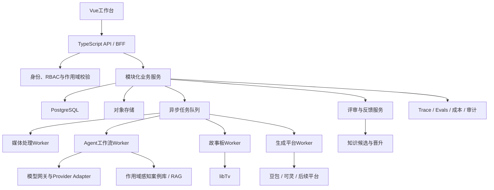

# 视频复刻AI平台重构设计

> 版本：v0.2 Draft  
> 日期：2026-06-23  
> 状态：用于项目重启与需求确认，未经评审不得直接视为最终实现规格  
> 关联文档：[Agent技术应用与选型参考](./agent-tech-selection-guide.md)、[项目架构决策ADR](./project-adr.md)、[Claude开发与审核规范](./claude-development-review-guide.md)

## 版本记录

| 版本 | 日期 | 主要变化 |
|---|---|---|
| v0.1 | 2026-06-23 | 建立多用户平台、Agent工作流、并发、反馈隔离和MVP边界 |
| v0.2 | 2026-06-23 | 增加基于VideoSpec的统一故事板阶段；豆包使用完整镜头级素描/非真实人脸策略，可灵使用经授权的真实角色策略 |

## 1. 项目定位

本项目是供约50名内部剪辑人员使用的多用户AI视频复刻工作平台，不是单用户聊天Agent。

系统负责管理：

- 对标视频和参考素材。
- 视频分析报告和证据帧。
- 分镜与提示词版本。
- 豆包、可灵及后续生成平台的任务。
- 人工评审、用户反馈和知识候选。
- Agent运行轨迹、评测、成本和故障恢复。

Agent是业务平台内的智能执行层；身份、权限、任务状态、数据版本和并发控制由确定性系统负责。

## 2. 当前已知业务背景

- 用户规模约50人，主要是剪辑人员。
- 短视频与长视频采用不同生成策略和平台。
- 系统需要分析对标视频、规划分镜、生成提示词，并逐步接入生图和生视频。
- 豆包和可灵两条链路都可以基于视频分析结果，通过libTv生成故事板；豆包使用完整镜头/场景级的素描故事板，表现构图、人物占位、动作、商品和道具，但不包含可识别真人脸，且不是单个角色的素描肖像；可灵可以使用经授权的真实角色外观。
- 连续分镜可能使用上一镜最后一帧作为下一镜起始参考。
- 用户会人工评审提示词，也会上传问题视频进行Diff和二次优化。
- 优秀提示词、目标视频、生成视频和反馈可以成为知识候选。
- 每个用户的数据和个人反馈需要隔离；经过审核的知识可以在项目、团队或公司范围共享。

## 3. 产品目标

1. 为剪辑人员提供可恢复、可追踪的AI视频复刻工作流。
2. 降低从对标视频到可用提示词/素材/视频的人工时间。
3. 保留每次分析、修改、反馈和生成的完整版本。
4. 防止用户之间的数据、反馈和个人偏好互相污染。
5. 支持约50名内部用户公平提交异步任务。
6. 用固定Evals证明模型、Prompt、RAG或Skill改动是否有效。
7. 为独立Agent Lab提供真实但脱敏的实验样本。

## 4. 第一阶段非目标

- 不建设开放式Agent Network。
- 不允许动态Skill自动发布到生产。
- 不进行在线自动微调。
- 不让模型自动把原始反馈写入团队知识库。
- 不追求无人参与的全自动视频发布。
- 不在第一版拆分大量微服务。
- 不在没有评测基线前接入Graph RAG或复杂多Agent协商。

## 5. 用户与角色

| 角色 | 主要权限 |
|---|---|
| Editor | 创建项目/任务、上传素材、编辑报告和提示词、提交反馈、查看授权范围内结果 |
| Reviewer | Editor权限；审核提示词、知识候选和团队案例 |
| Team Lead | 管理团队成员、项目可见范围、优先级和团队模板 |
| Admin | Workspace配置、供应商配置、配额、审计、公司级知识发布 |
| System Worker | 仅通过服务身份执行明确工具，不拥有交互式管理员权限 |

权限采用RBAC；数据访问同时受Workspace、Team、Project、Owner和Visibility约束。

## 6. 核心用户流程

第一条可交付纵向链路：


后续扩展链路：

```text
故事板批准
→ 提示词批准
→ 生图/素材编辑
→ 生视频任务
→ 结果分析
→ 与目标VideoSpec结构化Diff
→ 局部修改
→ 新版本或人工接管
```

## 7. 系统总体架构



### 7.1 架构原则

- 模块化单体优先，Worker进程可以独立扩容。
- API不执行长时间模型或视频任务。
- Worker无状态，任务状态持久化。
- 所有模型和生成平台通过Adapter隔离。
- 所有AI输入使用版本化快照，避免下游执行时上游内容被覆盖。
- 生产主链路与实验链路通过Feature Flag和独立配置隔离。

## 8. 建议模块边界

| 模块 | 职责 |
|---|---|
| Identity & Access | 登录、用户、团队、角色、作用域校验 |
| Project | 项目、成员、可见范围、项目规则 |
| Asset | 视频、图片、帧、字幕、文件元数据和对象存储引用 |
| Job | 异步任务、状态、重试、取消、优先级和配额 |
| Video Analysis | 抽帧、ASR/OCR结果、VideoSpec和证据 |
| Shot & Prompt | 分镜、StoryboardSpec、PromptSpec、版本和审批 |
| Storyboard | 调用libTv生成Provider专属故事板、面板版本、渲染策略和人工确认 |
| Generation | 生图/生视频Provider Adapter与外部任务状态 |
| Review & Feedback | 评审、评论、问题分类、人工修改和来源 |
| Knowledge | 知识候选、审核、作用域、RAG索引和Skill版本 |
| Agent Runtime | Workflow、节点输入输出、Checkpoint和预算 |
| Evaluation | Golden Dataset、离线回归和线上业务指标 |
| Observability | Trace、审计、模型调用、成本和故障回放 |

## 9. 核心领域对象

| 对象 | 说明 |
|---|---|
| Workspace | 公司级边界 |
| Team | 剪辑团队或子团队 |
| User | 用户身份和个人偏好边界 |
| Project | 一组相关复刻任务和规则 |
| Asset | 原视频、参考图、抽帧、音频、字幕和生成文件 |
| ReplicationTask | 一次视频复刻业务任务 |
| Run | Agent工作流的一次执行 |
| Job | 一个异步节点或外部调用任务 |
| VideoSpecVersion | 结构化视频分析版本 |
| ShotPlanVersion | 分镜方案版本 |
| StoryboardSpecVersion | 与Provider无关的故事板语义、构图、动作、景别、连续性和素材要求 |
| StoryboardVersion | 通过libTv生成的Provider专属故事板版本、面板和渲染模式 |
| PromptVersion | 提示词版本及对应Provider |
| GenerationAttempt | 一次生图/生视频尝试 |
| Review | 审批状态和审核结论 |
| Feedback | 用户反馈、作用域和问题类别 |
| KnowledgeCandidate | 尚未进入生产知识库的候选经验 |
| KnowledgeItem | 审核发布后的知识或案例 |
| SkillVersion | 版本化操作方法和测试结果 |

所有核心业务对象应包含：

```text
id
workspaceId
teamId（适用时）
projectId（适用时）
ownerId
visibility
version
createdAt / updatedAt
createdBy / updatedBy
```

## 10. 多人数据与反馈规则

1. 用户默认只能访问授权Project以及自己创建的Private数据。
2. 服务端、对象存储访问和RAG检索必须使用相同作用域。
3. Feedback不可直接覆盖VideoSpec、Prompt或Skill，只能创建新版本或知识候选。
4. 个人偏好只在当前User范围生效。
5. Project规则由项目授权人员批准。
6. Team/Workspace知识必须经过Reviewer/Admin晋升。
7. 被撤销、过期或来源失效的知识必须从检索索引移除。
8. 所有跨作用域访问和知识晋升产生审计记录。

## 11. 异步任务与并发设计

### 11.1 Job状态

```text
QUEUED
RUNNING
WAITING_EXTERNAL
NEEDS_REVIEW
SUCCEEDED
FAILED
CANCELLED
```

### 11.2 调度要求

- 用户、团队、任务类型和Provider均有可配置并发配额。
- 同一用户的大批量任务不能饿死其他用户任务。
- 外部Provider限流时执行Backpressure。
- 使用幂等键避免重复创建外部生成任务。
- 只对可安全重试的错误自动重试。
- 任务支持取消；取消外部任务失败时记录补偿状态。
- Worker崩溃后任务可由其他Worker继续或重新领取。
- 每个节点设置超时、最大尝试次数和成本预算。

### 11.3 并发验证

上线前至少覆盖：

- 多用户同时上传和创建任务。
- 单用户连续提交大量任务时的公平性。
- Provider限流、超时和长时间无响应。
- Worker重启和重复消息。
- 同一Prompt版本被并发修改。
- 队列积压后的恢复能力。

具体并发数字根据真实使用调查和Provider额度确定，不在设计阶段硬编码。

## 12. Agent工作流边界

生产主链路初始采用确定性Workflow：

```text
Ingest
→ Preprocess
→ AnalyzeToVideoSpec
→ ValidateEvidence
→ HumanReviewVideoSpec
→ PlanShots
→ BuildStoryboardSpec
→ RenderStoryboardViaLibTv
→ HumanReviewStoryboard
→ CompileProviderPrompt
→ ValidatePrompt
→ HumanReviewPrompt
→ Complete / Generate
```

模型只能在节点契约内生成候选结果；Workflow负责状态迁移、重试、审批和停止条件。

### 12.1 节点契约最低要求

- 输入Schema和版本。
- 输出Schema和版本。
- 可访问工具白名单。
- 最大模型调用次数。
- 超时与重试策略。
- 失败分类。
- Trace字段。
- 是否需要人工审批。

### 12.2 故事板阶段

系统先从已确认的`VideoSpecVersion`和`ShotPlanVersion`生成与Provider无关的`StoryboardSpecVersion`，再由Provider策略决定libTv的实际渲染方式。

| 目标Provider | 默认故事板策略 | 主要目的 |
|---|---|---|
| 豆包 | `SKETCH_NO_IDENTITY`：生成完整镜头/场景级素描故事板面板，以线稿或非身份化人物占位表现角色；不生成单个角色素描肖像，不提交可识别真人脸 | 保留构图、机位、角色位置、动作、商品、道具和节奏信息，同时满足平台对人脸参考素材的限制 |
| 可灵 | `REALISTIC_CHARACTER`：可使用经授权的真实角色参考和外观 | 保持角色身份、造型、场景和连续分镜一致性 |

统一的`StoryboardSpecVersion`至少规划以下语义，但具体Schema在对应开发任务中确定：

- 对应`shotId`和时间范围。
- 每个面板描述一个完整镜头或镜头内关键时刻，而不是孤立的角色肖像。
- 景别、构图、机位和镜头方向。
- 角色占位、动作起止和视线。
- 商品、道具、场景和光线。
- 首帧、尾帧和连续性要求。
- 来源证据帧和人工修改记录。
- 目标Provider、渲染模式和身份素材策略。

故事板必须版本化并在进入提示词编译或视频生成前允许人工确认。真实角色素材必须具备业务授权并遵循Provider规则；系统不得把“素描模式”实现成绕过平台安全策略的机制。

## 13. RAG、记忆与Skill边界

### 第一阶段

- 只使用审核案例RAG。
- 按Provider、模型版本、商品类型、镜头类型、时长、作用域过滤。
- 个人反馈仅作为当前任务输入或个人偏好候选。
- Skill由人工创建、版本化和测试。

### 实验阶段

- Agentic RAG、Graph RAG、动态Skill和Multi-Agent只在Agent Lab运行。
- 实验读取生产数据前必须脱敏并获得授权。
- 实验结果不得自动写回生产知识库。
- 通过固定Evals、成本和人工评审后才能提出晋升ADR。

## 14. 可观测性与审计

每个Run必须能够回答：

- 谁在什么项目发起了任务？
- 使用了哪些输入版本和素材？
- 使用了哪个StoryboardSpec、故事板版本、libTv参数和身份素材策略？
- 调用了哪个模型/Provider和哪个配置版本？
- RAG召回了哪些有权限的案例？
- 调用了哪些工具，参数和结果是什么？
- 哪个节点失败、重试或由人工修改？
- 消耗了多少时间、Token和外部调用成本？
- 最终结果基于哪个父版本？

敏感内容不直接写入普通日志；Trace保存引用、脱敏摘要或受控访问的加密内容。

## 15. MVP验收范围

MVP只要求打通：

1. 登录、角色与项目成员管理。
2. 多用户隔离上传素材。
3. 异步创建和执行视频分析任务。
4. 生成并校验版本化VideoSpec。
5. 人工编辑、确认和保留历史版本。
6. 建立版本化StoryboardSpec契约和Provider策略接口。
7. 生成Provider相关提示词候选。
8. 人工评审、反馈和创建新版本。
9. 完整Run Trace、任务重试和取消。
10. 用户/团队配额和基础成本统计。
11. 固定Evals能够在Prompt或模型变化后回归。

libTv故事板实际生成作为MVP后的首个业务里程碑，在接入最终生视频前完成。生图、生视频、案例RAG和Skill随后按独立里程碑接入。

## 16. 项目重启步骤

1. 冻结旧Demo，导出可复用API适配器、Prompt、案例和已知失败，不直接原地重构。
2. 确认本设计中的角色、作用域、工作流和MVP非目标。
3. 为VideoSpec、Job、Feedback和版本对象建立契约。
4. 创建新项目骨架和CI质量门禁。
5. 实现“登录→上传→异步分析→人工确认→StoryboardSpec→提示词→反馈”的纵向链路。
6. 使用至少两个用户验证数据隔离、并发修改和反馈作用域。
7. 接入libTv故事板：先实现豆包素描模式，再实现可灵真实角色模式，并共用统一StoryboardSpec。
8. 建立初始Golden Dataset和Run Trace后再接入RAG与Skill。
9. 通过负载、故障恢复和权限测试后交付小范围试用。
10. 根据真实队列、成本和用户反馈逐步扩大到约50人。

## 17. 待业务确认事项

以下事项不阻塞架构启动，但必须在对应模块开发前形成ADR或需求结论：

- 公司现有登录/SSO方式。
- Team和Project的真实组织关系。
- 用户默认能否查看同项目其他人的任务。
- Reviewer、Team Lead和Admin的实际人员分配。
- 日均任务量、峰值提交模式、文件大小和保留周期。
- 豆包、可灵、libTv等平台的真实API、限流和并发额度。
- 哪些素材包含肖像、客户数据或其他敏感信息。
- 故事板面板数量、分辨率、画幅、渲染风格和人工编辑方式。
- 豆包素描故事板保留哪些角色特征，哪些特征必须匿名化或占位化。
- 可灵真实角色参考的授权来源、存储权限、保留周期和可复用范围。
- 故事板是否支持首尾帧、每镜多面板以及跨分镜连续性锁定。
- 第一阶段是否执行视频生成，还是只交付提示词与素材。
- 知识晋升由谁批准、多久复审、何时过期。
- 成本配额是否按用户、项目或团队核算。
